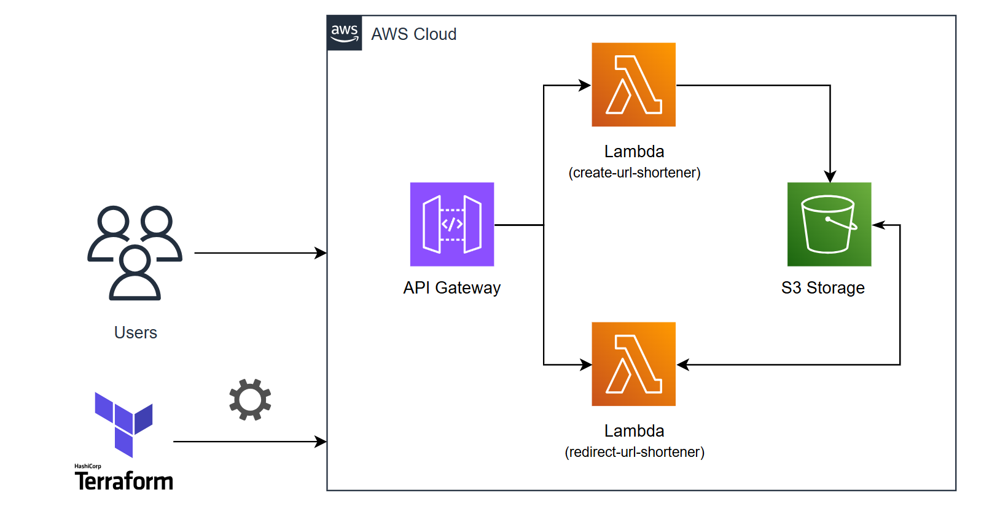
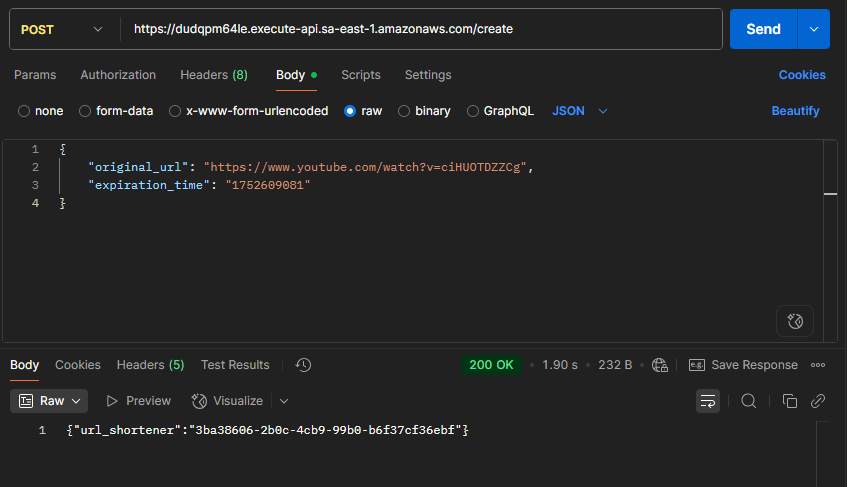

# Url Shortener




> Este projeto demonstra a criação de um encurtador de URLs funcional, desde a geração do link até o redirecionamento final do usuário.

## 💻 Pré-requisitos

Antes de começar, você precisa atender aos seguintes requisitos:

- Instalar a versão mais recente do [terraform](https://developer.hashicorp.com/terraform/install). para Iac (Infraestrutura como código) seguindo seu sistema operacional.
- Instalar a versão mais recente do [AWS CLI](https://docs.aws.amazon.com/cli/latest/userguide/getting-started-install.html) já que iremos a AWS como Cloud Provider
- Criar uma conta na AWS e configure de forma segura, habilitando o IAM Identity Center, crie um usuário com as permissões desejadas por lá (Eu criei como Admin) e, em seguida, use o comando `aws configure sso` na sua máquina para autenticar.

## 🚀 Instalando Url Shortener

Para instalar o Url Shortener, siga estas etapas:

OBS: Aqui é considerado que você já está autenticado com a aws com os requisitos acima atendidos. Adicione suas credenciais no arquivo `providers.tf` onde está comentado: 

``` h
provider "aws" {
  region  = "<your_region>"
  profile = "<your_profile_authenticated>"
}
```

OBS: Para criar um serviço do S3 Storage, é preciso que o nome seja único. Portanto, acesse o arquivo `locals.tf` e mude o valor do bucket_name para o nome único do seu bucket:

``` h
bucket_name = "<your_bucket_name>"
```

Isso também vale para os aquivos `index.ts` contidos nas pastas `/url-shortener-creation` e `/url-shortener-redirection`

``` typescript
const response = await client.send(
  new GetObjectCommand({
    Bucket: "<your_bucket_name>",
    Key: shortUrlCode + ".json"
  })
)
```

1 - Acesse a pasta `/infra` no terminal e rode o comando abaixo:

```
$ terraform init
```

2 - Acesse as pastas `/url-shortener-creation` e `/url-shortener-redirection` e, em cada uma, rode os comandos para instalar as dependências e gerar o build dos serviços respectivamente:

```
$ npm install
$ npm run build
```

3 - Use o comando abaixo para provisionar todos os serviços da AWS pré-configurados com o terraform. Use a flag `-auto-approve` caso queira pular a etapa de confirmar ação yes/no:

```
$ terraform apply -auto-approve
```

OBS: Caso você esteja com os serviços provisionados e deseja apagá-los novamente, você consegue fazer isso de forma simples usando o comando `terraform destroy -auto-approve`, mas com uma condição para o serviço do S3-Storage. O bucket precisa está vazio e sem objetos dentro dele.

## ☕ Usando Url Shortener

Agora com todos os serviços provisionados e tudo bem configurado, você precisa apenas pegar a url do API Gateway que é gerado nos outputs do terraform ao fazer o apply. Ao conseguir essa url, você pode realizar requisições usando ferramentas como httpie, insominia ou postman. Nesse exemplo, irei usar o postman.

Para criar uma url shortener, use `POST {url_api_gateway}/create` e adicione no body um json contendo `original_url` e `expiration_time` que contém a URL original na qual você deseja direcionar o usuário e tempo máximo em que o usuário poderá usar essa url encurtada, respectivamente.



Essa requisição retornará um `shortUrlCode` no campo `url_shortener`, um hash que irá servir para o redirecionamento dessa url encurtada. 

Agora você pode usar `GET {url_api_gateway}/{shortUrlCode}` que irá tentar redirecionar o usuário para a url original que estava sendo armazenado.

OBS: Use essa requisição no navegador, pois ela irá redirecionar o usuário e assim você verá o conteúdo em tela.

Essa ação pode ter 3 status code: 

1 - 200: Deu certo e redirecionou o usuário para a url original.
2 - 410: Deu erro, pois essa url encurtada estava expirada.
3 - 500: Deu erro interno no servidor. Acontece muito quando a shortUrlCode não é encontrada no S3. 

## 🛠️ Ferramentas


          
                    
